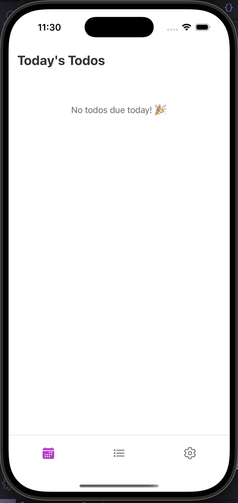
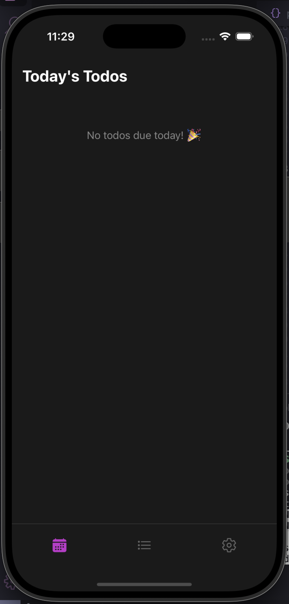
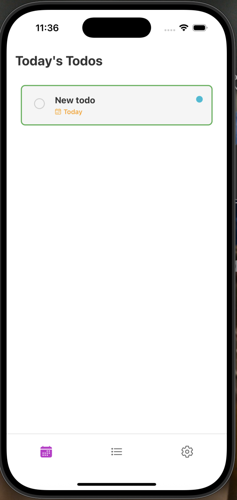
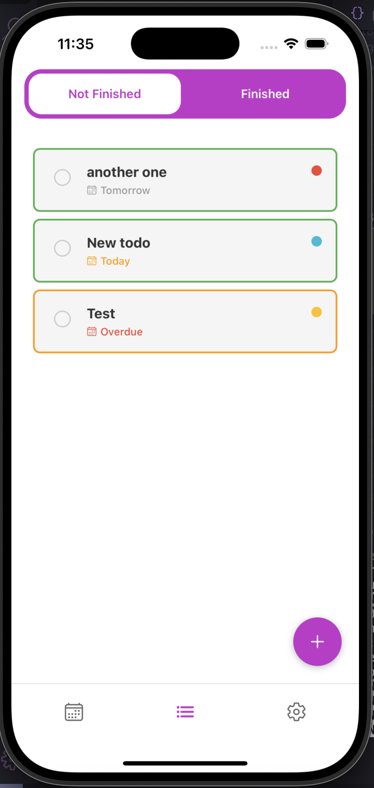
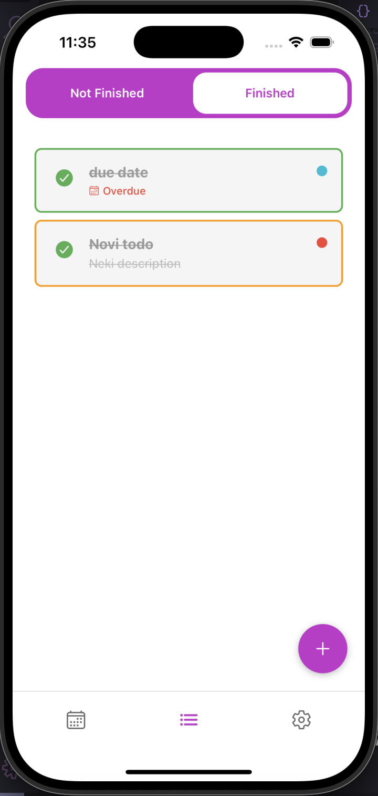
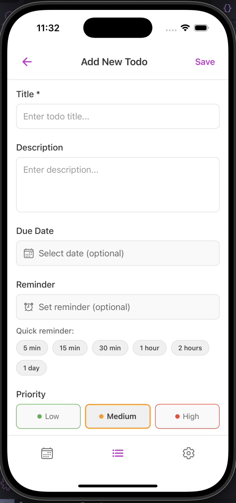
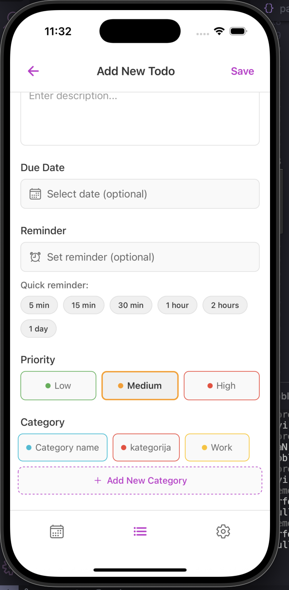
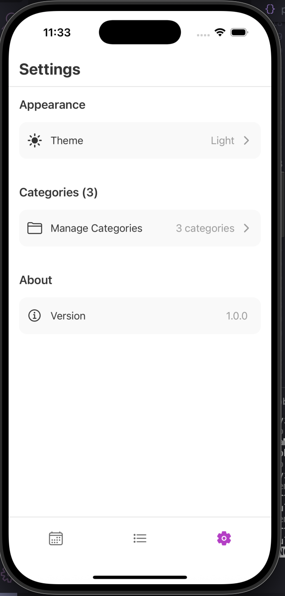
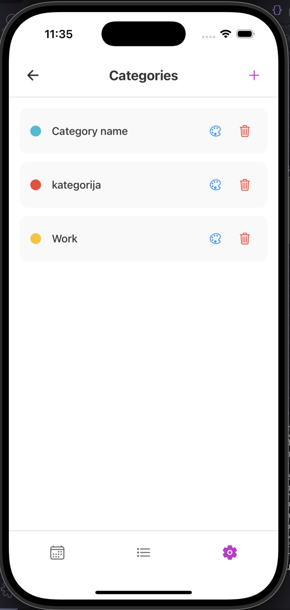
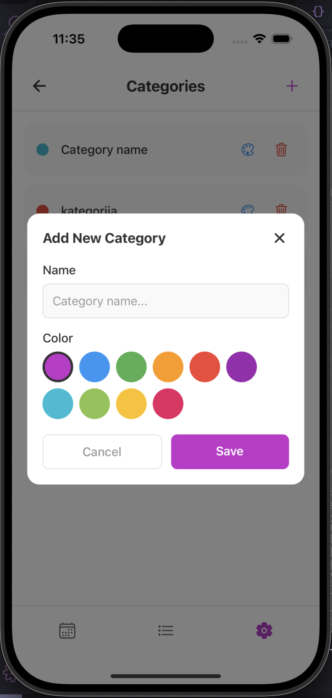

# todo app

[](https://opensource.org/licenses/MIT)

a simple React Native todo application with offline storage and push notifications.

## What it does

- Create, edit, and manage todos
- Organize todos with custom categories and colors
- Set due dates and priority levels
- Schedule reminder notifications
- Mark todos as completed
- Dark and light theme support

## Technologies used

- React Native with Expo
- WatermelonDB for offline storage
- TypeScript
- Expo Notifications for push notifications
- SQLite database

## Development Tools

- **Linting**: ESLint for code quality (`yarn lint`)
- **Formatting**: Prettier for consistent style (`yarn format`)
- **Testing**: Jest for unit tests (`yarn test`)
- **CI/CD**: GitHub Actions automatically checks code quality and runs tests on every push/PR

## Getting Started

### Prerequisites

- Node.js (v16 or higher)
- npm or yarn
- Expo CLI
- iOS Simulator or Android Emulator

### Installation

1. Clone the repository

```bash
git clone https://github.com/sadyazz/todo.git
cd todo
```

2. Install dependencies

```bash
npm install
# or
yarn install
```

3. Start the development server

```bash
npx expo start
```

4. Run on iOS simulator

```bash
npx expo run:ios
```

5. Run on Android emulator

```bash
npx expo run:android
```

## Screenshots

<details>
<summary></summary>
<br/>

<div align="center">










</div>

</details>
